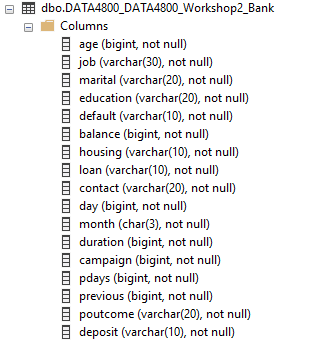
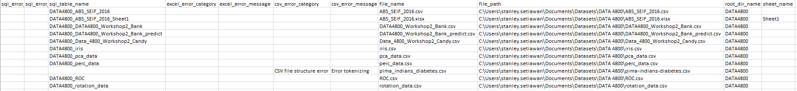

[TOC]

# Introduction

This project aims to automate the process of importing many Excel/CSV files into a SQL Server Database 

The Python script aims to make this task easier by:

- Going through a folder/directory and automatically iterate through all CSV/Excel worksheets in that directory and create new SQL Server table(s) generated from each CSV file/Excel worksheet in a SQL server database **(database name can be changed in the ini file passed to the script)**
- Create a single SQL server table from a CSV file/Excel file with a single worksheet OR create multiple database tables from an Excel file with multiple worksheets automatically
- Get the appropriate generic data type for each SQL server table column (`char(n)`/`varchar(n)`/`float`/`int`)
- Generate an output CSV file called `table_creation_log.csv` which contains corresponding SQL server table name created for each CSV/Excel worksheet 
- Record errors in the output `table_creation_log.csv` file if:
    - the script is unable to construct a dataframe from the CSV file
    - the script is unable to construct a dataframe from an Excel worksheet (to be added)
    - the script encounters errors when creating the database table or inserting values to the database table 

## Database Table Created

The script will automatically detect the generic data type of each column in the SQL Server table created from an Excel worksheet/CSV file. The generic data type can either be:

- `float` for columns with decimal number values (3.14,5.33,etc.)
- `char(n)` where n is the number of bytes used to store the string. This will be assigned to database columns where all of its values have the exact same number of characters
- `varchar(n)` where `n` is the number of bytes used to store the string. `n` is calculated by:
    - multiplying the max length of bytes required to store a value in a column with 2
    - Add 9 to the result from previous step 
    - Divide the result from previous step with 10 and get the quotient 
    - Multiple the quotient with 10. For instance:
        - max length of bytes required is 30 for a specific column. Hence, n = ((30 * 2) + 9) // 10 * 10. Hence n = 60
        - max length of bytes required is 71 for a specific column. Hence, n = ((71 * 2) + 9) // 10 * 10. Hence n = 150
        - max length of bytes required is 5 for a specific column. Hence, n = ((5 * 2) + 9) // 10 * 10. Hence n = 10 
  
    This will be assigned to columns with varying string length

- `int/bigint` will be assigned to columns which only contain numbers without decimal points

Below is a sample database table created by the script with automatic generic data type detected for each column



The script also detects which columns contain `null` and which columns don't contain any `null` values. It will then assign the `null` constraint in the resulting database table automatically. 

## Table Creation Log

The script will record database tables it creates into `table_creation_log.csv` CSV file. This file contains the following columns:

- `sql_error_category`: Lets user know what the type of SQL error that occurs. Can be either `SQL Table Creation` or `SQL Insert Value`
- `sql_error_message`:The exact error message returned when creating the database table/inserting value to the database table
- `sql_table_name`: The name of the database table created by the script
- `excel_error_category`: The type of error produced when trying to convert an Excel worksheet into dataframe
- `excel_error_message`: The exact error message if there's an error converting an Excel worksheet into a dataframe
- `csv_error_category`: The type of error produced when trying to convert a CSV file into a dataframe. Possible values are:
  - `CSV file structure error`
  - `CSV dataframe encoding error`
  - `CSV file is empty`
- `csv_error_message`: The exact error message if a CSV file can't be converted into a dataframe by the script
- `file_name`: the file name used by the script to create database table(s)
- `file_path`: Path to the file used by the script to create database table(s)
- `root_dir_name` The root directory where files are saved. This is used by the script as a prefix to the database table name
- `sheet_name`: An Excel worksheet name. Value of this column will be empty for CSV files

Below is a sample `table_creation_log.csv` generated by the script



# Help

Run `python .\CreateNewSQLTable.py --help` to view the help guide on how to use the script:
```
usage: CreateNewSQLTable.py [-h] [--folderPath FOLDERPATH]
                            [--filePath FILEPATH] [--scanFolder]
                            [--configFile CONFIGFILE]

optional arguments:
  -h, --help            show this help message and exit
  --folderPath FOLDERPATH
                        specify subject absolute folder path in which
                        excel/CSV files are located in
  --filePath FILEPATH   specify the file that should be imported to SQL Server
                        Table
  --scanFolder          should be executed first before even trying to import
                        CSV files into SQL Server Database. This flag is used
                        to scan all CSV files (but not Excel files for now)
                        and detect any possible error when reading them using
                        Python Pandas library
  --configFile CONFIGFILE
                        Pass the name of the ini file (without the <.ini>)
                        which contains the settings for SQL server database
                        the script must connect to
```

# Config File 

The sript must connect to the SQL Server Database to create new database tables from CSV and Excel files. 

The config `.ini` file is used to specify the details of the SQL server database the script must connect to and the content of the `.ini` file can be seen below:

```
[DB_CONFIG]
db_name = <db_name>
db_schema = <db_schema>
server_name = <server_name> 
windows_authentication = <yes/no> 
user_name = <user_name> 
password = <password> 
```

Then, save this `.ini` file under `<root_directory_of_the_project>/config`

Now, every time a user wants to create a new database table from a directory/an Excel file/a CSV file, they need to pass in this config file to the script with `--configFile <ini_file_name>` argument. The `<ini_file_name>` must not contain the `.ini` extension

---
**NOTE**

**User who wants to run the script with Windows Authentication does not need to specify the `user_name` and `password` field in the `.ini` config file**

---
&nbsp;


# Usage

## Scanning a directory for errors in CSV files
Before the script is used to import CSV files into the database, user might want to examine whether the script can convert CSV files contained within a directory into a dataframe or check whether or not the script has issues in detecting the CSV file encoding when importing it to the database

In order to do so, run the command below in PowerShell

```
python .\CreateNewSQLTable.py `
--folderPath "<directory_path>" `
--scanFolder 
```

If the script finds potential errors which prevents it from reading the CSV files in the directory, it shall output something like

```
{'csv_error_category': 'CSV file is empty',  
 'csv_error_message': EmptyDataError('No columns to parse from file'),
 'filePath': 'path\to\file\\JC-201608-citibike-tripdata.csv'}
{'csv_error_category': 'CSV file structure error', 
 'csv_error_message': ParserError('Error tokenizing data. C error: Expected 11 fields in line 8, saw 12\n'),
 'filePath': 'path\to\file\customers.csv'}
{'csv_error_category': 'CSV file structure error', 
 'csv_error_message': ParserError('Error tokenizing data. C error: Expected 18 fields in line 3, saw 19\n'),
 'filePath': 'path\to\file\employees.csv'}
```
We can now see that in this directory:

- `JC-201608-citibike-tripdata.csv` CSV file is empty
- In `customers.csv`, the script expects 11 columns in line 18 but finds 12 values separated by comma instead 
- In `employees.csv`, the script expects 18 columns in line 3 but finds 19 values separated by comma instead

With this, user can modify/fix the CSV file before they run the script to import CSV/Excel files into the database. 

---
**NOTE**

**Notice that user does not need to pass `--configFile` argument to the script when the script is meant only to scan a directory. This is because the script does not need to connect to the database, it simply iterates through CSV files in a directory to find potential errors when running the script to create database tables for all files in the folder**

---
&nbsp;

## Create Database Table(s) from a Single Excel/CSV file 

The script can be used to:

- Create a single SQL server table from a CSV file/Excel file with a single worksheet 
- create multiple database tables from an Excel file with multiple worksheets

The command to be used for this is:

```
python .\CreateNewSQLTable.py `
--filePath "<file_path>" `
--configFile <config_ini_name>
```

## Create Database Table(s) from all CSV/Excel Files Within a Directory

This is the main function of the script. The script will iterate through all Excel worksheets and CSV files in a directory **(including all sub-directories inside the directory)** and create database table(s) from each Excel worksheet/CSV file. 

The command to be used in this case is:

```
python .\CreateNewSQLTable.py `
--folderPath "<path_to_directory_containing_datasetes>" `
--configFile <config_ini_name>
```


