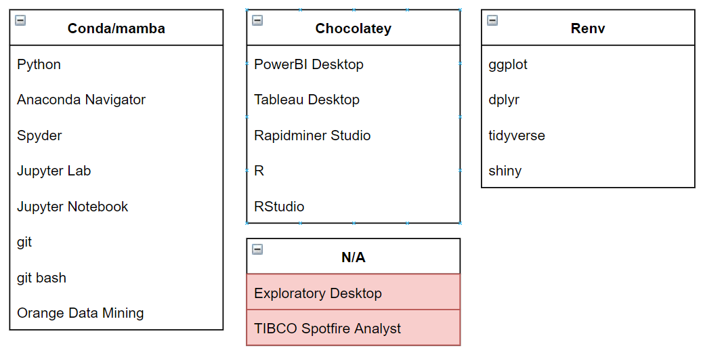

# Rebuilding MBATS Applications

This project contains all the PowerShell scripts to re-install data analytics applications used by KBS on a new Windows Server

Currently, the project only has `Rebuild_Conda_Env` directory which will re-create the conda/mamba data analytics environment on a fresh Windows Computer/Server. 

In the future, if Kaplan somehow is interested to go down this route of rebuilding data analytics applications automatically on a new/fresh server then they need to add a mechanism to re-build applications managed by **Chocolatey** Package manager as well as **R packages**

This is because the data analytics environment in KBS can be classified into 4 different groups based on the package managers that can be used to manage each application:

1. `Conda/mamba` application group:

	These are the list of applications that can be managed with conda/mamba in the KBS system.

2. `Chocolatey` application group:

	These are the list of applications which I believe to be best managed by `chocolatey` package manager. Well, some applications like `Tableau Desktop`, `Rapidminer Studio` and `PowerBI Desktop` can only be managed with `chocolatey` on Windows. 

3. `Renv` application group:

	This is the list of R packages/R related applications which can be automatically managed/patched with `Renv` package manager. 

4. `N/A` application group:

	I couldn't find any package manager that can be used to manage applications in this list. Hence, any update/installation must be done manually *(for now)*. There might be a way to automate their installation but it'll require a lot of scripting and I don't know if it's worth it for applications in this list.
