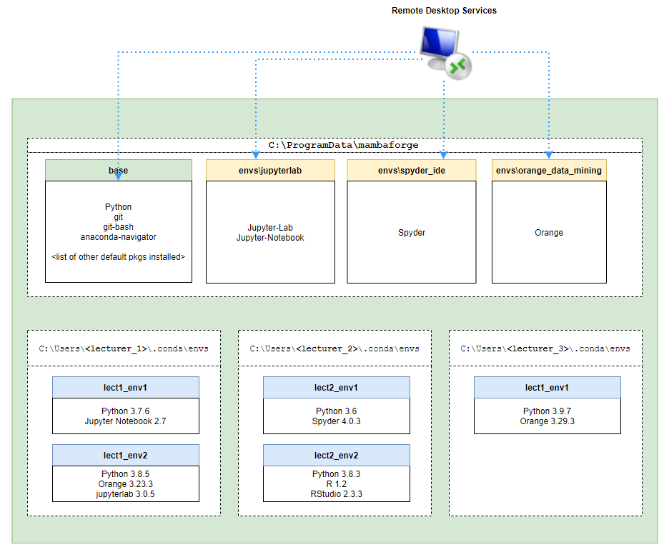
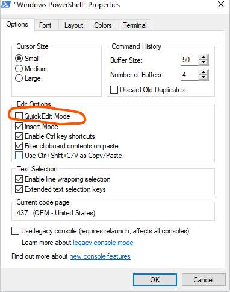

[TOC]

# Rebuilding MBATS Applications
This project contains all the PowerShell scripts to re-install data analytics applications used by KBS on a new Windows Server

`mamba_installer.exe` is included in this repository but it might not be the most up-to-date one. In order to get the latest installer, please run `mamba_download.ps1` PowerShell script to get the latest Windows mamba package manager installer from mambaforge

# Final Conda/Mamba Environment Setup After Running the Script

After running the script, this should be the final conda environment setup: 



Essentially, the script will create system-level conda virtual environments and install the applications specified in `virtual_envs` directory JSON or YAML files into their specified environments:

- `base` environment contains these applications:
  - git
  - git-bash
  - anaconda-navigator
- `jupyterlab` environment contains these applications:
  - Jupyter-Lab
  - Jupyter-Notebook
- `spyder_ide` environment contains these applications:
  - Spyder
- `orange_data_mining` environment contains these applications:
  - Orange

Finally, the script will deploy each application inside each virtual environment as a Remote Desktop Services Remote App. This means that after running the script, users should be able to download the relevant RDP files from RDWeb used to run each application listed above 

The bottom half of the diagram shows that lecturers will still be able to create their own virtual environments under their user directory with whatever packages they want. 

# Before Running the Script


## **Turn Off/Deactivate ZScaler**

Please turn off ZScaler/deactivate it before running this script. I've tried running the script with ZScaler on my Windows Server 2022 Virtual Machine and the VM was unable connect to the internet and download the packages with ZScaler turned on. 

## **Run Scripts as Admin**

It is IMPORTANT to remember that the user must have administrator access to the server and they need to run this script AS admin

## **Set up the Remote Desktop Services Properly**

This project assumes that the Remote Desktop Services have been established on the server the script is executed on 

## **Disable Quick Edit Mode**

Please disable **Quick Edit Mode** on **PowerShell** and **Command Prompt** as you can see in the image below



Having the **"Quick Edit Mode"** enabled will cause PowerShell and Command Prompt operation to pause when you click on the PowerShell/Command Prompt window and this happens a few times during my testing. As such, before a user runs the script, please make sure to disable this mode on Command Prompt and PowerShell 

# Script Configuration

## **Virtual Environments Config**
The `virtual_envs` directory contains 2 sub-directories:

- `json` sub-directory contains a set of JSON files where each file corresponds to a virtual environment the script is going to create on the server as well as the packages that will be installed inside each virtual environment. For instance, in the `base.json` file, we define:

    ```
    {
        "name":"base",
        "packages":[
        {
            "pkg_manager":"mamba",
            "channel":"conda-forge",
            "pkg_names":[
            "git",
            "git-bash"
            ]
        },
        {
            "pkg_manager":"mamba",
            "channel":"defaults",
            "pkg_names":[
            "anaconda-navigator"
            ]
        }
        ]
    }
    ```
    which states that we want to install **`git`,`git-bash` and `anaconda-navigator`** packages in `base` virtual environment. Some other details include:
  
  -  `pkg_manager` which defines the package manager you want to use to install this package. Please always use `"mamba"` here as much as possible unless you need to download something from PyPi in which case you need to specify `"pip"` here
  - `channel` which defines the channel you want the package to be downloaded from. You can even define a custom channel here (if Kaplan has one)

- `yaml` sub-directory which contains all the YAML files where each file corresponds to a virtual environment the script is going to create on the server as well as the packages that will be installed inside each virtual environment. Below is a sample of what the YAML file might look like:

  ```
  name: base
  channels:
      - conda-forge
  dependencies:
      - conda-forge::git
      - conda-forge::git-bash
      - defaults::anaconda-navigator
  ```
  The YAML file above tells the script to install **`git`,`git-bash` and `anaconda-navigator`** packages in `base` virtual environment.
  
  Just like the JSON files, we can specify the packages to be installed for each virtual environment and the channel where the package is going to be downloaded from. 


# Running the Script

## **Parameters**

The main script for this project is `main.ps1` and user can pass 4 different parameters to this PowerShell script. Most of these parameters are optional with `RunCmdDir` parameter being the only mandatory parameter that user must specify every time they run the script:

- `InstallMamba` **[Optional]** is a **PowerShell switch parameter** which dictates whether or not you want the script to install **mamba** and **conda** environment/package manager to the server. If the server already has conda/mamba installed, user might not want to install them again and this is why this option was provided. 
- `GetLatestMamba` **[Optional]** is a **PowerShell switch parameter** which dictates if the user wants to re-download the **mamba_installer.exe** to ensure that the mamba/conda package manager installed on the server are the latest versions. 
- `VenvCreationMethod` **[Optional]** is a parameter that accepts only 2 possible string values:

  - `default`: 
  	
	If **"default"** is passed as value to this parameter, the script will read the `virtual_envs/yaml/*.yaml` YAML files to create the virtual environments and install applications inside each virtual environment
  
  	This method of virtual environment creation will rely on the default mechanism provided by mamba/conda package managers. **This option will ensure that all packages specified in each YAML file is installed. However, because of that, the Python version installed in each virtual environment might be a siginificantly older version of Python**. 
  
  - `custom` **[default parameter value]**: 

  	If **"custom"** is passed as value to this parameter, the script will read the `virtual_envs/json/*.json` JSON files to create the virtual environments and install applications inside each virtual environment

  	This method of virtual environment creation will execute a custom logic defined in the PowerShell script to create the virtual environment and install packages for each environment. **This option ensures that a relatively new Python version is installed for each virtual environment. However, a few packages specified in the JSON files might not be installed caused by the incompatibility issue between the Python and the package version.**

	With that said, this is the preferred method of virtual environment creation as incompability between the Python version and the packages is a very rare occurrence and this issue might not exist in the future.

- `RunCmdDir` **[Mandatory]** accepts a string value which specifies a directory path where the PowerShell scripts constructed by this project to run each application will be saved to.

## **Example Usage**

Suppose that a user wants to:

- Install the latest version of mamba and conda environment/package managers
- Create the virtual environments and install applications specified inside each JSON file in `virtual_envs/json` with the  custom PowerShell logic **(to ensure that a relatively new Python version is installed for each environment)**.
- Save all resulting PowerShell run scripts to `"C:\Users\Admin\Desktop\run_cmd_dir"`
- Publish all the applications defined in `publish_apps/*.json` JSON files as remote apps

In order to do so, the user must go to the root directory of this project and run:

```
./main.ps1 `
-InstallMamba `
-GetLatestmamba `
-RunCmdDir "C:\Users\Admin\Desktop\run_cmd_dir"
```

Remember, the user didn't need to specify `VenvCreationMethod` parameter above as the default value assigned to `VenvCreationMethod` parameter is `"custom"`.

Now, suppose there's another situation where the user wants to :

- Install mamba and conda WITHOUT having to download the latest mamba installers
- Create the virtual environments and install applications specified inside each YAML file in `virtual_envs/YAML`and use the default conda/mamba package installation mechanism **(to ensure that all packages are installed)**. 
- Save all resulting PowerShell run scripts to `"C:\Users\Admin\Desktop\run_cmd_dir"`
- Publish all the applications defined in `publish_apps/*.json` JSON files as remote apps

In order to do so, the user must go to the root directory of this project and run:

```
./main.ps1 `
-InstallMamba `
-VenvCreationMethod "default" `
-RunCmdDir "C:\Users\Admin\Desktop\run_cmd_dir"
```
  


