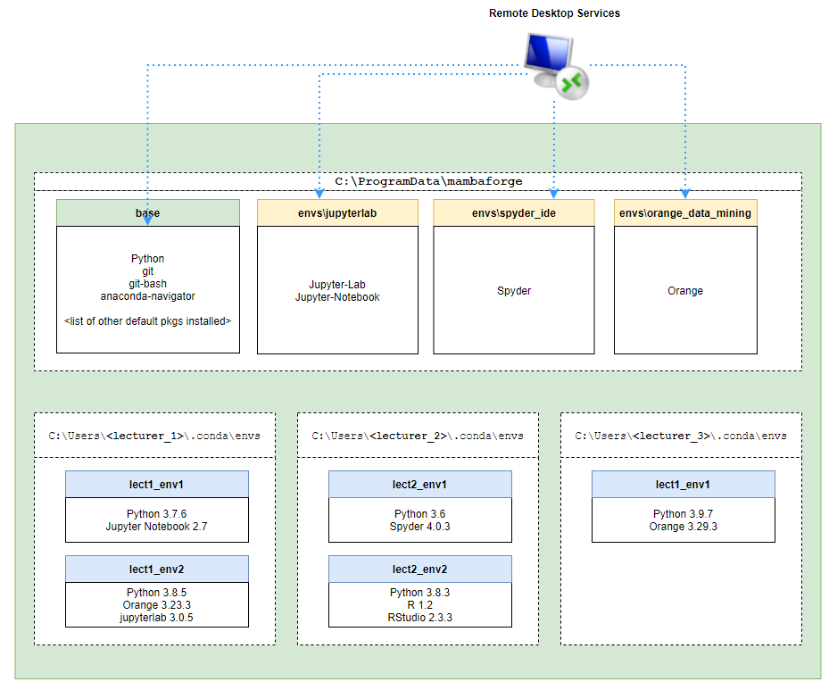
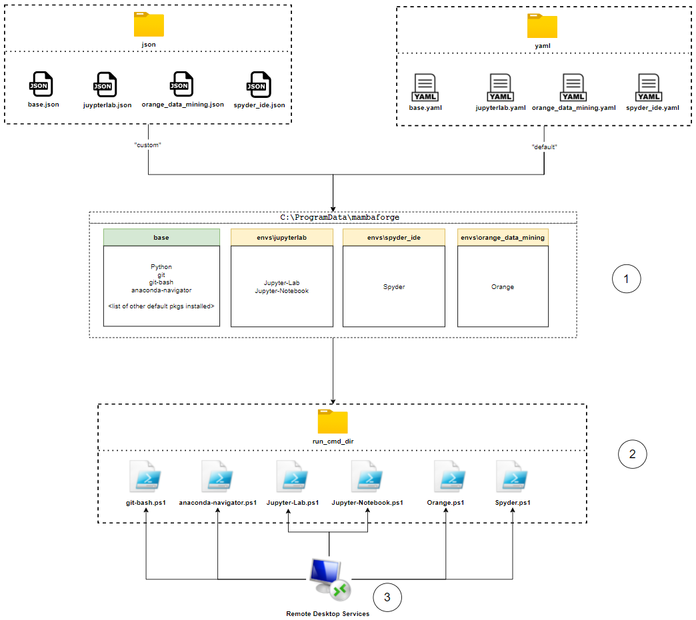
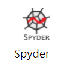
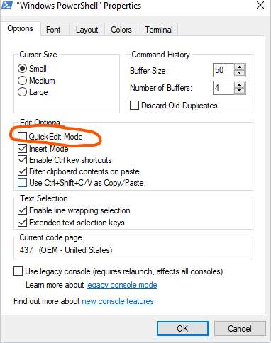

[TOC]

# Script Workflow

## **High Level Overview** 

Essentially, this project is designed to create system-level conda/mamba data science/analytics virtual environments and install the applications specified in `virtual_envs` directory JSON or YAML files into their specified environments.

After running the script, this should be the final conda environment setup: 



The bottom half of the diagram above shows that lecturers will still be able to create their own virtual environments under their user directory with whatever packages they want. 

The list of system-level virtual environments created by this project script are:

- `base` environment contains these applications:
    - git
    - git-bash
    - anaconda-navigator
- `jupyterlab` environment contains these applications:
    - Jupyter-Lab
    - Jupyter-Notebook
- `spyder_ide` environment contains these applications:
    - Spyder
- `orange_data_mining` environment contains these applications:
    - Orange

Finally, the script will deploy each application inside each virtual environment as a Remote Desktop Services Remote App. This means that after running the script, users should be able to download the relevant RDP files from RDWeb used to run each application listed above.  

## **More Detailed Overview**

When a user executes `main.ps1` PowerShell script in this project, the script will do 3 things:

1. **Read JSON/YAML files to create Virtual Environment**

    First, it's going to read JSON or YAML files inside the `virtual_envs` directory. The script is going to create a data science/analytics virtual environment specified inside each JSON/YAML file. So essentially, each JSON/YAML file dictates the configuration of each virtual environment that the admin user wants to create and the system admin is free to modify/add things to these configuration files.

2.  **Create `run command scripts`**

    Once all virtual environments are created, the script will **generate Powershell Scripts to open each application located within each virtual environment**. These PowerShell scripts are important for the next step where applications are going to be published as remote apps with RDS. 

    The configuration for this step is located in JSON files inside the `publish_apps` directory. There are 3 parameters inside each JSON file in that directory used at this step:

    - The `env_name` specifies the name of virtual environment the application is located in 
    - The `run_command` will specify the command that must be executed to open the application inside the virtual environment
    - The `start_dir` specifies directory you want an application to be opened from **(this is done to set the working directory of the application)**
  
    

    Each **`run command script`** is a very simple script which contains this form of PowerShell code:

    ```
    Set-Location <start_dir>
    conda activate <env_name>
    <run_command>
    ```

    **`Set-Location <start_dir>`** will change the directory where you want the application to be opened from. I noticed this doesn't really matter for most applications but in some applications like `Jupyter-Lab`, this command will set the working directory for the application before you open it. 

    **`conda activate <env_name>`** will activate the conda/mamba virtual environment created in **Step 1**. This is important as each virtual environment have their own set of executable paths. 

    **`<run_command>`** is used to run the application within the conda/mamba virtual environment. The run command can range from something really simple like `"jupyter lab"` which will open the **Jupyter Lab** application with the default web browser on the server or it can be something much more complex like 
    
    `python $env:CONDA_PREFIX/cwp.py $env:CONDA_PREFIX bash --login -i --` 
    
    which will open `git-bash` in a virtual environment

3.  **Publishing `run command script`(s) as Remote Apps**

    Finally, `publish_apps.ps1` PowerShell script will publish each **run_command_script** created from the previous section as a remote app. This means that instead of publishing an `".exe"` executable of an application as remote app, we're publishing each PowerShell script as a remote app which allows for more flexibility and control over how each application will be opened by user. 

Below is a diagram which attemps to visualise all 3 steps outlined above:



# Script Configuration

## **Virtual Environments Config**
The `virtual_envs` directory contains 2 sub-directories:

- `json` sub-directory contains a set of JSON files where each file corresponds to a virtual environment the script is going to create on the server as well as the packages that will be installed inside each virtual environment. For instance, in the `base.json` file, we define:

    ```
    {
        "name":"base",
        "packages":[
            {
                "pkg_manager":"mamba",
                "channel":"conda-forge",
                "pkg_names":[
                    "git",
                    "git-bash"
                ]
            },
            {
                "pkg_manager":"mamba",
                "channel":"defaults",
                "pkg_names":[
                    "anaconda-navigator"
                ]
            }
        ]
    }
    ```
    which states that we want to install **`git`,`git-bash` and `anaconda-navigator`** packages in `base` virtual environment. Some other details include:
  
    -  `pkg_manager` which defines the package manager you want to use to install this package. Please always use `"mamba"` here as much as possible unless you need to download something from PyPi in which case you need to specify `"pip"` here
    - `channel` which defines the channel you want the package to be downloaded from. You can even define a custom channel here (if Kaplan has one)

- `yaml` sub-directory which contains all the YAML files where each file corresponds to a virtual environment the script is going to create on the server as well as the packages that will be installed inside each virtual environment. Below is a sample of what the YAML file might look like:

    ```
    name: base
    channels:
        - conda-forge
    dependencies:
        - conda-forge::git
        - conda-forge::git-bash
        - defaults::anaconda-navigator
    ```
    The YAML file above tells the script to install **`git`,`git-bash` and `anaconda-navigator`** packages in `base` virtual environment.
    
    Just like the JSON files, we can specify the packages to be installed for each virtual environment and the channel where the package is going to be downloaded from. 

## **Publish Apps Config**

### RDS (Remote Desktop Services) Config

This is the JSON file the user can find in the root directory of this project named `"publish_apps_config.json'`. This JSON file contains the **RDS CollectionName** as well as the **Connection Broker**. Please set these values to the right one before running the script

### Remote Apps Config

These are JSON files located inside `publish_apps` directory which will be used to specify these 2 things for each application:

- **Specify the `run command script` for each application**
    
    Suppose we have a JSON config file located in `publish_apps` directory which look like this:

    ```
    [
        {
            "env_name":"jupyterlab",
            "run_command":"jupyter lab",
            "alias":"jupyterlab",
            "display_name":"Jupyter-Lab",
            "start_dir":"C:/Users/Administrator/Documents/Datasets",
            "icon_path":"icons/jupyterlab.ico"
        },
        {
            "env_name":"jupyterlab",
            "run_command":"jupyter notebook",
            "alias":"jupyter-notebook",
            "display_name":"Jupyter-Notebook",
            "start_dir":"C:/Users/Administrator/Documents/Datasets",
            "icon_path":"icons/jupyter-notebook.ico"
        }
    ]
    ```

    ---
    **IMPORTANT**

    Please make sure that the `start_dir` exists on the server and it's a path where users can modify datasets/scripts

    ---

    As there are 2 appliations listed in this JSON file, this JSON configuration file is going to create 2 `run command scripts`, one for `Jupyter-Lab.ps1` and the other one `Jupyter-Notebook.ps1`. As previously mentioned in the previous section, each `run command script` is a very simple script which contains this from of PowerShell code:

    ```
    Set-Location <start_dir>
    conda activate <env_name>
    <run_command>
    ```

    Hence, `Jupyter-Lab.ps1` will contain this PowerShell script:

    ```
    Set-Location C:/Users/Administrator/Documents/Datasets
    conda activate jupyterlab
    jupyter lab
    ```

    and then `Jupyter-Notebook.ps1` will contain this PowerShell script:

    ```
    Set-Location C:/Users/Administrator/Documents/Datasets
    conda activate jupyterlab 
    jupyter notebook
    ```

- Specify the **`alias`**, **`display_name`** as well as **`icon_path`** for each published Remote App on RDWeb 
    
    For instance, this JSON file configuration for `Spyder` application:

    ```
    [
        {
            "env_name":"spyder_ide",
            "run_command":"spyder",
            "alias":"spyder",
            "display_name":"Spyder",
            "start_dir":"C:/Users/Administrator/Documents/Datasets",
            "icon_path":"./publish_apps/icons/spyder.ico"
        }
    ]
    ```

    The PowerShell script will take the `alias`, `display_name` and `icon_path` to generate this Remote app on RDWeb:

    


# Before Running the Script


## **Turn Off/Deactivate ZScaler**

Please turn off ZScaler/deactivate it before running this script. I've tried running the script with ZScaler on my Windows Server 2022 Virtual Machine and the VM was unable connect to the internet and download the packages with ZScaler turned on. 

## **Run Scripts as Admin**

It is IMPORTANT to remember that the user must have administrator access to the server and they need to run this script AS admin

## **Set up the Remote Desktop Services Properly**

This project assumes that the Remote Desktop Services have been established on the server the script is executed on 

## **Disable Quick Edit Mode**

Please disable **Quick Edit Mode** on **PowerShell** and **Command Prompt** as you can see in the image below



Having the **"Quick Edit Mode"** enabled will cause PowerShell and Command Prompt operation to pause when you click on the PowerShell/Command Prompt window and this happens a few times during my testing. As such, before a user runs the script, please make sure to disable this mode on Command Prompt and PowerShell 

# Running the Script

## **Parameters**

The main script for this project is `main.ps1` and user can pass 4 different parameters to this PowerShell script. Most of these parameters are optional with `RunCmdDir` parameter being the only mandatory parameter that user must specify every time they run the script:

- `InstallMamba` **[Optional]** is a **PowerShell switch parameter** which dictates whether or not you want the script to install **mamba** and **conda** environment/package manager to the server. If the server already has conda/mamba installed, user might not want to install them again and this is why this option was provided. 

- `GetLatestMamba` **[Optional]** is a **PowerShell switch parameter** which dictates if the user wants to re-download the **mamba_installer.exe** to ensure that the mamba/conda package manager installed on the server are of the latest versions. 

- `VenvCreationMethod` **[Optional]** is a parameter that accepts only 2 possible string values:

    - `default`: 
        
        If **"default"** is passed as value to this parameter, the script will read the `virtual_envs/yaml/*.yaml` YAML files to create the virtual environments and install applications inside each virtual environment
    
        This method of virtual environment creation will rely on the default mechanism provided by mamba/conda package managers. **This option will ensure that all packages specified in each YAML file is installed. However, because of that, the Python version installed in each virtual environment might be a siginificantly older version of Python**. 
    
    - `custom` **[default parameter value]**: 

        If **"custom"** is passed as value to this parameter, the script will read the `virtual_envs/json/*.json` JSON files to create the virtual environments and install applications inside each virtual environment

        This method of virtual environment creation will execute a custom logic defined in the PowerShell script to create the virtual environment and install packages for each environment. **This option ensures that a relatively new Python version is installed for each virtual environment. However, a few packages specified in the JSON files might not be installed caused by the incompatibility issue between the Python and the package version.**

        With that said, this is the preferred method of virtual environment creation as incompability between the Python version and the packages is a very rare occurrence and this issue might not exist in the future.

- `RunCmdDir` **[Mandatory]** accepts a string value which specifies a directory path where the PowerShell `run command scripts` constructed by this project to run each application will be saved to.

## **Example Usage**

Suppose that a user wants to:

- Install the latest version of mamba and conda environment/package managers
- Create the virtual environments and install applications specified inside each JSON file in `virtual_envs/json` with the  custom PowerShell logic **(to ensure that a relatively new Python version is installed for each environment)**.
- Save all resulting PowerShell run scripts to `"C:\Users\Admin\Desktop\run_cmd_dir"`
- Publish all the applications defined in `publish_apps/*.json` JSON files as remote apps

In order to do so, the user must go to the root directory of this project and run:

```
./main.ps1 `
-InstallMamba `
-GetLatestmamba `
-RunCmdDir "C:\Users\Admin\Desktop\run_cmd_dir"
```

Remember, the user didn't need to specify `VenvCreationMethod` parameter above as the default value assigned to `VenvCreationMethod` parameter is `"custom"`.

Now, suppose there's another situation where the user wants to :

- Install mamba and conda WITHOUT having to download the latest mamba installer
- Create the virtual environments and install applications specified inside each YAML file in `virtual_envs/YAML`and use the default conda/mamba package installation mechanism **(to ensure that all packages are installed)**. 
- Save all resulting PowerShell run scripts to `"C:\Users\Admin\Desktop\run_cmd_dir"`
- Publish all the applications defined in `publish_apps/*.json` JSON files as remote apps

In order to do so, the user must go to the root directory of this project and run:

```
./main.ps1 `
-InstallMamba `
-VenvCreationMethod "default" `
-RunCmdDir "C:\Users\Admin\Desktop\run_cmd_dir"
```

# Testing Results

## **Windows Server 2022 Standard Edition VM with Hyper-V**


When testing the script on a Windows Server 2022 Standard Edition VM with Hyper-V, here are the results:

| Operation   | Successful | Comment|
|-------------|-------------|-----------|
| Getting Latest Mamba Installer| yes |No error when downloading the latest mamba installer AS LONG as ZScaler is turned off|
| Installing Mamba| Yes|The script was able to use the existing installer included inside this repository to install mamba and conda|
| Creating Virtual Environemnts| Yes|No problem in creating any virtual environments. However, I do notice that one or two packages under `orange_data_mining` virtual environment output an error when during their installation. This, however, does not affect the final virtual virtual environment created for Orange data mining application and as such it's a low priority concern. Ideally though, this needs to be fixed.|
| Creating `run command scripts`|Yes|No problem in creating run command scripts in a specific directory|
| Publish application(s) as Remote Apps|N/A|Can't be tested on the VM because this requires Remote Desktop Services |

## **Windows Server 2016 EC2 Instance [KAP-AWS-RDSS-1N]**


When testing the script on KAP-AWS-RDSS-1N Non-Prod, Windows Server 2016 AWS EC2 instance, below are the results:

| Operation   | Successful | Comment|
|-------------|-------------|-----------|
| Getting Latest Mamba Installer| no|There's an error with TLS/SSL certificate which might be related to Sophos or other security application on the server preventing the script to download the latest mamba installer from mamba GitHub page|
| Installing Mamba| Yes|The script was able to use the existing installer included inside this repository to install mamba and conda|
| Creating Virtual Environemnts| Yes|No problem in creating the virtual environments and all applications work with no problem|
| Creating `run command scripts`|Yes|Run command scripts are created at the specified directory path|
| Publish applications as Remote Apps|Yes|Applications are Deployed as Remote Apps on RDWeb. However, every an application is launched as a remote app, the Powershell window will pop up as well. Perhaps there's a way to prevent this by modifying the code |

Script finishes its execution after about 30 minutes during my testing.

# Proposed Improvements

## **Performance**

The script is bound by I/O of the file system. Currently, the script is running sequentially such that it installs each virtual environment and generate the `run command script` one at a time. Instead of doing this, multiprocessing/multithreading or any form of parrallel programming and concurrency must be added to this project so that the program can create multiple virtual environments at the same time. I believe this will make the script executes significantly faster.

## **Build Scripts for Other Platforms**

Currently, the purpose of this project is to rebuild conda/mamba environment for a Windows Server environment with RDS. With that said, this project can also be useful to create a base image for data analytics environment as well. Please do remember however that there needs to be extra development time to create a separate version of scripts for Unix/Linux environment. Either that or find a way to run PowerShell scripts in a Linux environment. 

## **Providing Script for Students**

In addition, this script can be useful to build data analytics environment on students' local machine as well which ensures consistency between what is being taught by lecturers and the conda/mamba applications on students' machine. 


