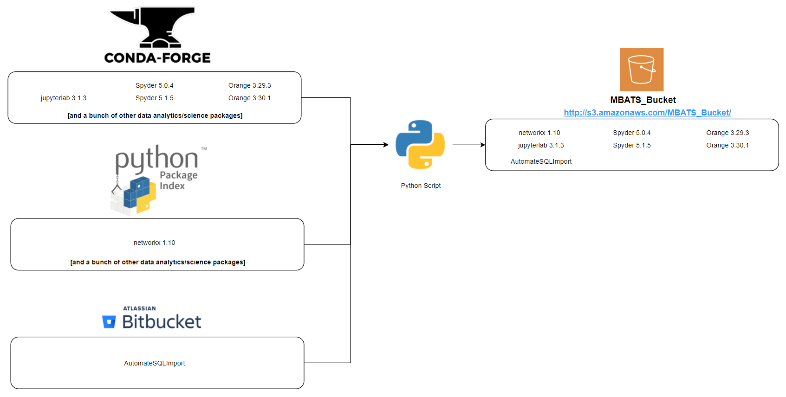

[TOC]

# Source of Python Packages

In general, there are 2 source of Python packages:

- **`PyPI (Python Package Index)`**: A repository maintained by the Python community where a user can find and download Python applications and packages. In order to download and install packages from PyPI, the user must use the **`pip`** package manager. 
- **`Anaconda`**: A repository maintained by the data analytics community which contains many Python packages as well as data analytics packages for other languages like R. In order to download and install packages from PyPI, the user must use the **`conda` or `mamba` (mamba is highly recommnended, it's so much faster than conda)** environment/package manager. 

At the time of this writing, KBS MBATS Prod server (KAP-AWS-RDSS-1) already has conda installed and lecturers/instructors at KBS seem to prefer conda package manager and hence why this project aims to create a **"custom conda channel"** for **conda/mamba package manager** (this might change in the future depending on lecturers at KBS).

# Advantages of Internalizing Packages

Creating our own **private PyPI server** or custom conda channel introduce many advantages for the company such as:
- Ensure security as each internal package will be subjected to a rigorous automated security check process
- Restrict package installations and searches to only those packages defined in the company's private repository
- Give the company the ability to package their own internal Python tools into this private server/custom conda channel
- Give the company the ability to version their own internal Python tools

# Example

Let's think about a scenario where Kaplan wants to internalise these packages below:

- jupyterlab 3.1.3 hosted on `conda-forge` channel
- spyder 5.0.4 hosted on `conda-forge` channel
- orange3 3.29.3 hosted on `conda-forge` channel
- orange3 3.30.1 hosted on `conda-forge` channel
- networkx 1.10 hosted on PyPI (Python Package Index)

Below are sections which will explain the steps required to achieve this

## Download distribution package tarball **(.tar.bz2)** Files

Each package hosted on anaconda and PyPI has their own tarball file:

- For anaconda, the tarball file for a package is located at **`https://anaconda.org/<channel_name>/<package_name>/files`**
    - In the case of `jupyterlab` hosted on `conda-forge`, this will be **`https://anaconda.org/conda-forge/jupyterlab/files`**
    - In the case of `spyder` hosted on `conda-forge` channel, this will be **`https://anaconda.org/conda-forge/spyder/files`**
    - In the case of `orange3` hosted on `conda-forge` channel, this will be **`https://anaconda.org/conda-forge/orange3/files`**

        Below is an example of `orange3` tarball files hosted on anaconda `conda-forge` channel
        

- For a package hosted on PyPI, the tarball file for that package is located at **`https://pypi.org/project/<package_name>/#files`**

    - For `networkx` package hosted on PyPI, this will be **`https://pypi.org/project/networkx/#files`**

        Below is an example of `networkx` tarball file hosted on PyPI 
        

## Create Custom Conda Channel

Create a structure as defined in [this conda documentation](https://docs.conda.io/projects/conda/en/latest/user-guide/tasks/create-custom-channels.html) once you have the tarball files and also run the commands as defined in that documentation to create our own custom conda channel. 

This custom conda channel can live on a server, fileshare or even an S3 bucket. 

# Automate the process 

This steps outlined above can be easily automated by writing a script **(doesn't have to be a Python script, can be any programing language)** which will automatically:

- Search for each package tarball **(.tar.bz2)** file. This script can be executed regularly every week or so to check if there's a new version of packages and download their tarball **(.tar.bz2)** files. Essentially, Kaplan must create a simple web scraper which sends HTTP GET requests to download tarball files from those locations. 
- Create the structure as defined in [the conda documentation](https://docs.conda.io/projects/conda/en/latest/user-guide/tasks/create-custom-channels.html) with the tarball files placed inside the directory structure as specified. 
- Run the commands specified in the documentation to generate the metadata files required for conda/mamba to search for packages in this custom channel 

# Packaging Python project

If Kaplan wishes to start packaging their own python projects and host their own internal packages in this custom conda channel then things are a bit more complicated. This is outside the scope of this documentation but you can start from these documentations:

- [Packaging Python Projects](https://packaging.python.org/en/latest/tutorials/packaging-projects/)
- [Building Conda Packages From Scratch](https://conda.io/projects/conda-build/en/latest/user-guide/tutorials/build-pkgs.html)

In the end, Kaplan should be able to have a system which can automatically internalise Python packages for lecturers to use be it their own internal packages or public packages hosted on PyPI and conda. The final result should reflect something outlined in the diagram below

